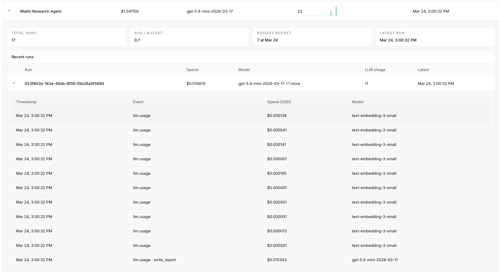

# Research Agent with Runtime Guardrails

A simple, budget-controlled research agent that searches the web, scrapes and compresses sources, and generates markdown reports -- without running out of control.

**~70 research questions for $1.** Perfect for quick lookups where you need a fast answer to know where to dig deeper: which foods are on a specific diet, initial research on AI agent architectures, comparing tool options, etc. 


## What this repo demonstrates

This is a controlled research agent with:
- 💸 Budget enforcement (~$0.02 per run)
- 🔍 Web search + scraping + semantic compression
- 📊 Cost + usage tracking

Inspired by [gpt-researcher](https://github.com/assafelovic/gpt-researcher), it uses a simple linear pipeline and exposes its capabilities over the [Agent-to-Agent (A2A) protocol](https://google.github.io/A2A/) so any A2A-compatible client can invoke it.

## Architecture

The agent runs a four-step linear pipeline:

```
query
  |
  v
search              -- web search via Tavily
  |
  v
scrape + compress   -- fetch pages with Crawl4AI, compress via embeddings
  |
  v
assemble context    -- join compressed pages, truncate if needed
  |
  v
generate report     -- single LLM call to produce markdown report
```

Each step is a plain async function -- no graph framework, no multi-agent orchestration. The entire pipeline is ~165 lines of code.

## ActGuard - Budget Control

<!-- TODO: replace with an actual screenshot of the ActGuard dashboard -->


[ActGuard](https://actguard.ai) is integrated as a budget control and cost tracking layer. Every expensive operation in the pipeline -- LLM calls, web searches, and page scrapes -- is wrapped in an ActGuard budget guard. This prevents runaway API costs during research.

How it works:
- Each research run is started with a configurable cost limit (default: 500 units)
- Individual operations are tracked under named guards (`search`, `scrape`, `write_report`)
- If the budget is exceeded mid-run, ActGuard raises a `BudgetExceededError` and the agent returns a graceful error instead of continuing to spend

To enable budget tracking, visit [actguard.ai](https://actguard.ai), create a free account, and add your `ACTGUARD_API_KEY` to `.env`. If unset, budget tracking is disabled.

## Key Libraries

| Library | Purpose |
|---|---|
| [Tavily](https://tavily.com/) | Web search API optimized for AI agents. |
| [Crawl4AI](https://github.com/unclecode/crawl4ai) | Async web scraper with headless browser and markdown extraction. |
| [OpenAI Embeddings](https://platform.openai.com/docs/guides/embeddings) | Semantic compression -- keeps only the chunks relevant to the query. |
| [ActGuard](https://actguard.ai) | Budget control and cost tracking for AI agent operations. |
| [A2A SDK](https://google.github.io/A2A/) | Agent-to-Agent protocol. Exposes the agent as a JSON-RPC endpoint. |
| [LangChain OpenAI](https://python.langchain.com/) | OpenAI integration for LLM calls with structured output. |

## Project Structure

```
research-agent/
├── app/
│   ├── __init__.py
│   ├── __main__.py                # Entry point -- starts the A2A server
│   ├── agent_executor.py          # A2A AgentExecutor implementation
│   ├── config.py                  # Settings (env vars + defaults)
│   ├── a2a_auth.py                # HMAC authentication middleware
│   ├── researcher/
│   │   ├── graph.py               # Research pipeline (search → scrape → compress → report)
│   │   ├── prompts.py             # LLM prompt templates
│   │   ├── schemas.py             # Pydantic output models
│   │   ├── errors.py              # Custom exceptions
│   │   └── actguard_client.py     # ActGuard client initialization
│   └── services/
│       ├── llm.py                 # OpenAI async client
│       ├── search.py              # Tavily search client
│       ├── scraper.py             # Crawl4AI web scraper
│       └── embeddings.py          # Semantic compression via embeddings
├── scripts/
│   └── sign_request.py            # Send HMAC-signed A2A requests (testing helper)
├── config/
│   └── a2a_auth.json              # A2A authentication config
├── tests/
│   ├── test_client.py             # Integration tests (A2A endpoints)
│   └── test_graph.py              # Unit tests (pipeline execution)
├── .env.example
├── .gitignore
├── pyproject.toml
└── uv.lock
```

## Prerequisites

- Python 3.12+
- [uv](https://docs.astral.sh/uv/) package manager
- An [OpenAI API key](https://platform.openai.com/api-keys)
- A [Tavily API key](https://app.tavily.com/)
- (Optional) An [ActGuard](https://actguard.ai) account (free) for measuring agent cost

## Quick Start

```bash
# 1. Clone the repo
git clone https://github.com/ActGuard/research-agent.git
cd research-agent

# 2. Copy the env template and fill in your API keys
cp .env.example .env

# 3. Install dependencies
uv sync

# 4. Start the agent server
uv run python -m app
```

The server starts on `http://localhost:10000`. Verify it's running:

```bash
curl http://localhost:10000/.well-known/agent.json
```

## Environment Variables

| Variable | Default | Description |
|---|---|---|
| `OPENAI_API_KEY` | *(required)* | OpenAI API key |
| `TAVILY_API_KEY` | *(required)* | Tavily search API key |
| `A2A_HMAC_SECRET` | `""` | 64-char hex string (256-bit) for signing A2A requests. Generate one with `openssl rand -hex 32` |
| `ACTGUARD_API_KEY` | `""` | ActGuard API key for cost tracking. Create a free account at [actguard.ai](https://actguard.ai). Optional -- budget tracking is disabled if unset |
| `HOST` | `localhost` | Server bind address |
| `PORT` | `10000` | Server port |
| `OPENAI_MODEL` | `gpt-4o-mini` | Default OpenAI model |
| `MAX_SEARCH_RESULTS` | `5` | Tavily results per query |
| `MAX_SCRAPE_URLS` | `5` | Max pages to scrape per run |
| `MAX_CONTEXT_CHARS` | `50000` | Context truncation limit |
| `REPORT_FORMAT` | `markdown` | Output format hint passed to the report writer |

<details>
<summary>Model & embedding overrides</summary>

| Variable | Default | Description |
|---|---|---|
| `MODEL_WRITE_REPORT` | `OPENAI_MODEL` | Model used for report generation |
| `EMBEDDING_MODEL` | `text-embedding-3-small` | Embedding model for semantic compression |
| `CHUNK_SIZE` | `1000` | Characters per chunk for embedding |
| `CHUNK_OVERLAP` | `100` | Overlap between chunks |
| `SIMILARITY_THRESHOLD` | `0.75` | Minimum similarity to keep a chunk |

</details>

## Invoking the Agent

Pass your research question as a command-line argument:

```bash
uv run python scripts/sign_request.py "What are the main approaches to quantum error correction?"
```

> **Note:** Queries are limited to 400 characters.

The script sends a signed A2A `message/send` JSON-RPC request to the running server and prints the response. A successful response looks like:

```json
{
  "jsonrpc": "2.0",
  "id": 1,
  "result": {
    "status": { "state": "completed" },
    "artifacts": [
      {
        "artifactId": "...",
        "name": "Research Report",
        "parts": [{ "text": "# Quantum Error Correction\n..." }]
      }
    ]
  }
}
```

## Testing

Unit tests (runs the pipeline directly -- requires API keys):

```bash
uv run pytest tests/test_graph.py
```

Integration tests (requires a running server):

```bash
uv run python -m app &        # start the server
uv run pytest tests/test_client.py
```

## References

- [gpt-researcher](https://github.com/assafelovic/gpt-researcher) -- inspiration for the research pipeline
- [A2A protocol](https://google.github.io/A2A/) -- Agent-to-Agent interoperability spec
- [Tavily](https://tavily.com/) -- search API for AI agents
- [Crawl4AI](https://github.com/unclecode/crawl4ai) -- async web scraper with headless browser
- [ActGuard](https://actguard.ai) -- budget control for AI agents
