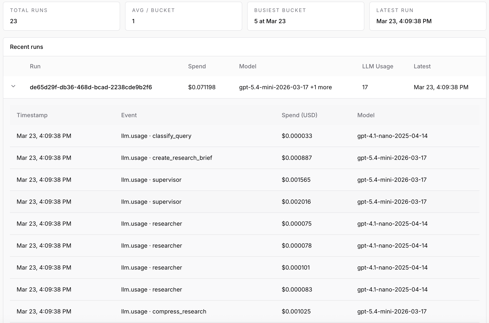

# Research Agent with Runtime Guardrails

A multi-step research agent built with LangGraph that can:
- plan research tasks 
- search the web
- extract structured evidence
- generate reports 

** But unlike most agents — it doesn’t run out of control. **

## What this repo demonstrates

This is a controlled research agent with:
- 💸 Budget enforcement (~$0.05–$0.10 per run) 
- 🔁 Multi-step reasoning (LangGraph)
- 📊 Cost + usage tracking

Inspired by [gpt-researcher](https://github.com/assafelovic/gpt-researcher), it uses a supervisor-researcher architecture built on [LangGraph](https://langchain-ai.github.io/langgraph/) and exposes its capabilities over the [Agent-to-Agent (A2A) protocol](https://google.github.io/A2A/) so any A2A-compatible client can invoke it.

## Architecture

The agent runs a multi-stage [LangGraph](https://langchain-ai.github.io/langgraph/) pipeline with a two-tier supervisor-researcher design:

```
START
  |
  v
classify_query          -- determine query type (quick / standard / deep / comparison)
  |
  v
create_research_brief   -- expand the query into a detailed research brief
  |
  v
research_supervisor     -- supervisor subgraph that orchestrates parallel researchers
  |   |
  |   +-- researcher 1  (web_search, scrape_url) --> compress
  |   +-- researcher 2  (web_search, scrape_url) --> compress
  |   +-- researcher N  (web_search, scrape_url) --> compress
  |
  v
write_report            -- synthesize all research notes into a markdown report
  |
  v
[refine_report]         -- critical review & revision (skipped for quick queries)
  |
  v
END
```

**Supervisor** orchestrates the research by deciding which topics to investigate and delegating them to parallel researcher agents. It uses three tools: `think` (reflect on gaps), `ConductResearch` (launch researchers), and `ResearchComplete` (signal done).

**Researchers** are independent ReAct agents that use `web_search` (Tavily) and `scrape_url` (Crawl4AI) tools to gather information. Their findings are compressed into concise notes and fed back to the supervisor.

## ActGuard -- Budget Control

<!-- TODO: replace with an actual screenshot of the ActGuard dashboard -->


[ActGuard](https://actguard.ai) is integrated as a budget control and cost tracking layer. Every expensive operation in the pipeline -- LLM calls, web searches, and page scrapes -- is wrapped in an ActGuard budget guard. This prevents runaway API costs during research.

How it works:
- Each research run is started with a configurable cost limit (default: 500 units)
- Individual operations are tracked under named guards (`classifier`, `supervisor`, `researcher_search`, `researcher_scrape`, `compress_research`, `write_report`, `refine_report`)
- If the budget is exceeded mid-run, ActGuard raises a `BudgetExceededError` and the agent returns a graceful error instead of continuing to spend

To enable budget tracking, visit [actguard.ai](https://actguard.ai), create a free account, and add your `ACTGUARD_API_KEY` to `.env`. If unset, budget tracking is disabled.

## Key Libraries

| Library | Purpose |
|---|---|
| [Tavily](https://tavily.com/) | Web search API optimized for AI agents. Powers the `web_search` tool used by researchers. |
| [Crawl4AI](https://github.com/unclecode/crawl4ai) | Async web scraper with headless browser and markdown extraction. Powers the `scrape_url` tool. |
| [LangGraph](https://langchain-ai.github.io/langgraph/) | Graph-based agent orchestration. Defines the entire research pipeline and subgraphs. |
| [ActGuard](https://actguard.ai) | Budget control and cost tracking for AI agent operations. |
| [A2A SDK](https://google.github.io/A2A/) | Agent-to-Agent protocol. Exposes the agent as a JSON-RPC endpoint. |
| [LangChain OpenAI](https://python.langchain.com/) | OpenAI integration for LLM calls with tool/function calling support. |

## Project Structure

```
research-agent/
├── app/
│   ├── __init__.py
│   ├── __main__.py                # Entry point -- starts the A2A server
│   ├── agent_executor.py          # A2A AgentExecutor implementation
│   ├── config.py                  # Settings (env vars + defaults)
│   ├── a2a_auth.py                # HMAC authentication middleware
│   ├── researcher/
│   │   ├── graph.py               # LangGraph pipeline wiring
│   │   ├── nodes.py               # Node implementations (classify, brief, report)
│   │   ├── prompts.py             # LLM prompt templates
│   │   ├── tools.py               # Tool definitions (supervisor & researcher)
│   │   ├── schemas.py             # Pydantic output models
│   │   ├── state.py               # Graph state schemas
│   │   ├── errors.py              # Custom exceptions
│   │   └── actguard_client.py     # ActGuard client initialization
│   └── services/
│       ├── llm.py                 # OpenAI async client
│       ├── search.py              # Tavily search client
│       └── scraper.py             # Crawl4AI web scraper
├── scripts/
│   └── sign_request.py            # Send HMAC-signed A2A requests (testing helper)
├── config/
│   └── a2a_auth.json              # A2A authentication config
├── tests/
│   ├── test_client.py             # Integration tests (A2A endpoints)
│   └── test_graph.py              # Unit tests (graph execution)
├── .env.example
├── .gitignore
├── pyproject.toml
└── uv.lock
```

## Prerequisites

- Python 3.12+
- [uv](https://docs.astral.sh/uv/) package manager
- An [OpenAI API key](https://platform.openai.com/api-keys)
- A [Tavily API key](https://app.tavily.com/)
- (Optional) An [ActGuard](https://actguard.ai) account (free) for measuring agent cost

## Quick Start

```bash
# 1. Clone the repo
git clone https://github.com/ActGuard/research-agent.git
cd research-agent

# 2. Copy the env template and fill in your API keys
cp .env.example .env

# 3. Install dependencies
uv sync

# 4. Start the agent server
uv run python -m app
```

The server starts on `http://localhost:10000`. Verify it's running:

```bash
curl http://localhost:10000/.well-known/agent.json
```

## Environment Variables

| Variable | Default | Description |
|---|---|---|
| `OPENAI_API_KEY` | *(required)* | OpenAI API key |
| `TAVILY_API_KEY` | *(required)* | Tavily search API key |
| `A2A_HMAC_SECRET` | `""` | 64-char hex string (256-bit) for signing A2A requests. Generate one with `openssl rand -hex 32` |
| `ACTGUARD_API_KEY` | `""` | ActGuard API key for cost tracking. Create a free account at [actguard.ai](https://actguard.ai). Optional -- budget tracking is disabled if unset |
| `HOST` | `localhost` | Server bind address |
| `PORT` | `10000` | Server port |
| `OPENAI_MODEL` | `gpt-4o-mini` | Default OpenAI model for all pipeline steps |
| `MAX_SUB_QUERIES` | `4` | Number of sub-queries the planner generates |
| `MAX_SEARCH_RESULTS` | `5` | Tavily results per query |
| `REPORT_FORMAT` | `markdown` | Output format hint passed to the report writer |

<details>
<summary>Per-step model overrides</summary>

Override the model used at each pipeline step. If unset, falls back to `OPENAI_MODEL`.

| Variable | Pipeline Step |
|---|---|
| `MODEL_CLASSIFY` | Query classification |
| `MODEL_BRIEF` | Research brief creation |
| `MODEL_SUPERVISOR` | Supervisor orchestration |
| `MODEL_RESEARCHER` | Individual researchers |
| `MODEL_COMPRESS` | Research compression |
| `MODEL_WRITE_REPORT` | Report writing |
| `MODEL_REFINE_REPORT` | Report refinement |

</details>

## Invoking the Agent

Edit the query in `scripts/sign_request.py` to set your research topic, then send an HMAC-signed request to the running server:

```bash
uv run python scripts/sign_request.py
```

The script sends a signed A2A `message/send` JSON-RPC request and prints the response. A successful response looks like:

```json
{
  "jsonrpc": "2.0",
  "id": 1,
  "result": {
    "status": { "state": "completed" },
    "artifacts": [
      {
        "artifactId": "...",
        "name": "Research Report",
        "parts": [{ "text": "# Quantum Error Correction\n..." }]
      }
    ]
  }
}

## Testing

Unit tests (runs the LangGraph pipeline directly -- requires API keys):

```bash
uv run pytest tests/test_graph.py
```

Integration tests (requires a running server):

```bash
uv run python -m app &        # start the server
uv run pytest tests/test_client.py
```

## References

- [gpt-researcher](https://github.com/assafelovic/gpt-researcher) -- inspiration for the research pipeline
- [A2A protocol](https://google.github.io/A2A/) -- Agent-to-Agent interoperability spec
- [Tavily](https://tavily.com/) -- search API for AI agents
- [Crawl4AI](https://github.com/unclecode/crawl4ai) -- async web scraper with headless browser
- [LangGraph](https://langchain-ai.github.io/langgraph/) -- graph-based agent orchestration
- [ActGuard](https://actguard.ai) -- budget control for AI agents
